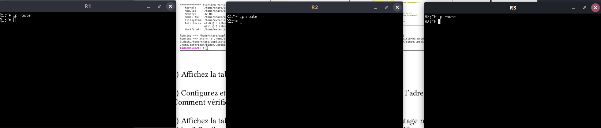
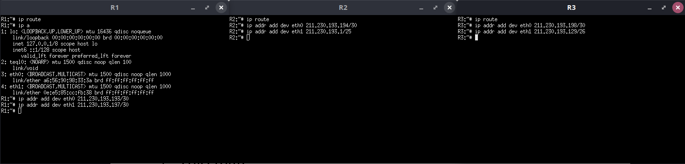
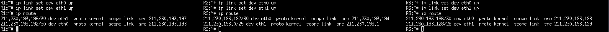
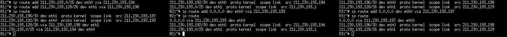
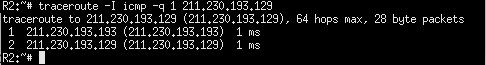
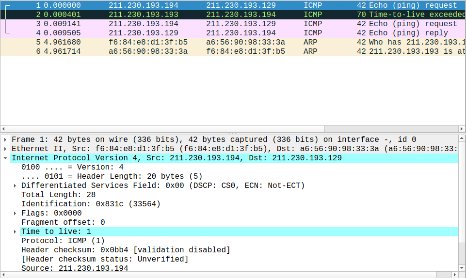
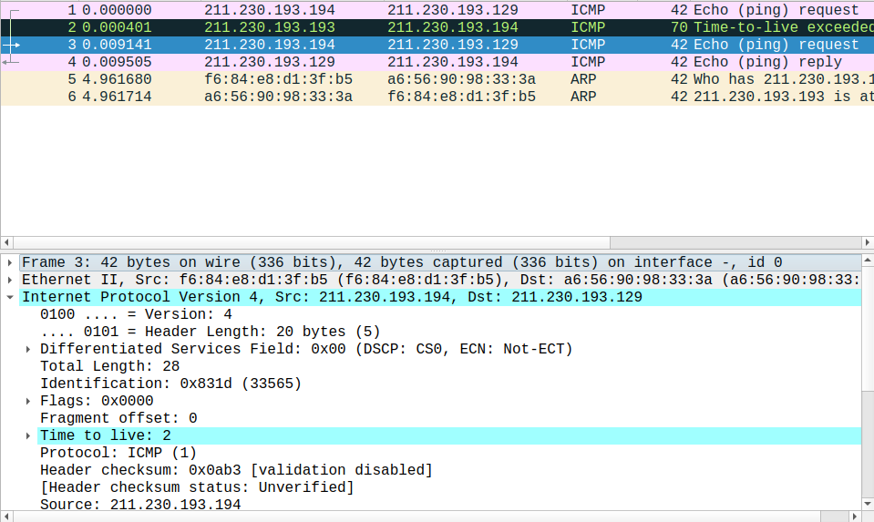

# TP2 - Lucas Plé

## 1. Routage statique

Q1: Les tables de routage des 3 routeurs que l'on vient de lancer sont vides.



Q2: J'ai réutilisé les mêmes adresses que définies en TD, à savoir :
```
R1 : eth0 : 211.230.193.193/30      eth1 : 211.230.193.197/30
R2 : eth0 : 211.230.193.194/30      eth1 : 211.230.193.1/25
R3 : eth0 : 211.230.193.198/30      eth1 : 211.230.193.129/26 
```

Les commandes lancées sur les différents routeurs sont donc celles-ci :



Pour vérifier que les interfaces sont effectivement configurées avec les adresses IP que l'on vient de donner, on utilise la commande `ip address` pour voir les adresses des interfaces de chaque routeur.

.png)

Une fois que les interfaces sont configurées avec les adresses IP correctes, il faut activer ces interfaces. On peut alors lancer ces deux commandes sur chaque routeur :
```
ip link set dev eth0 up
ip link set dev eth1 up
```

Q3: Les routes déjà présentes dans la table sont celles permettant de rediriger vers les réseaux connectés aux routeurs, via leurs interfaces. C'est le système qui les a ajouté automatiquement lors de l'activation des interfaces. La mention `scope link` signifie qu'il s'agit de routes pour des réseaux directement connectés au routeur.



Q4: Pour que tous les routeurs puissent communiquer avec tous les autres réseaux, il faut ajouter les routes suivantes :

```
Pour R1 :
Vers le réseau A -> par eth0 via 211.230.193.194 (eth0 de R2)
Vers le réseau B -> par eth1 via 211.230.193.198 (eth0 de R3)

Pour R2 :
Vers les réseaux b et B -> par eth0 via 211.230.193.193 (eth0 de R1)

Pour R3 : 
Vers les réseaux a et A -> par eth0 via 211.230.193.197 (eth1 de R1)
```

On exécute donc les commandes suivantes :
```
Sur R1 :
ip route add 211.230.193.0/25 dev eth0 via 211.230.193.194
ip route add 211.230.193.128/26 dev eth1 via 211.230.193.198

Sur R2 :
ip route add 0.0.0.0/0 dev eth0 via 211.230.193.193

Sur R3 :
ip route add 0.0.0.0/0 dev eth0 via 211.230.193.197
```

Après ajout des routes, les tables de routage sont dans l'état suivant :



Sur la capture d'écran ci-dessus, j'ai oublié de spécifier le masque réseau pour les routes par défaut sur les routeurs R2 et R3. J'ai rectifié cette erreur juste après en essayant de ping R3 depuis R2.

## 2. Traceroute

Q1: 



Q2: Cette commande renvoie les différents routeurs traversés par le paquet envoyé pour arriver à la destination demandée.

Q3: La première adresse affichée correspond à l'interface eth0 du routeur R1 et la deuxième adresse correspond à l'interface eth1 de R3.

Q4: Le Time To Live du premier paquet envoyé par R2 est à 1. On peut le voir avec wireshark :



Q5: Ce paquet transporte un message au protocole ICMP. Ce message est de Type 8, à savoir une requête ping.

Q6 & Q7: Ce paquet ne parvient pas jusqu'à sa destination car on voit que R1 répond à R2 directement en envoyant un message `Time-to-live exceeded`. Ce message appartient également au protocole ICMP et est de Type 11. Cette réponse signifie que le paquet a été détruit dans R1 car son Time To Live est arrivé à 0 en traversant R1. Ce-dernier prévient donc R2 que son paquet a été détruit, faut de Time To Live restant.

Q8: Le TTL du 2e paquet envoyé par R2 est de 2.


Q9: Ce paquet parvient jusqu'à sa destination puisque le paquet suivant qui passe par eth0 de R1 est la réponse à ce paquet.

Q10: C'est R3 qui répond à ce paquet avec un message du protocole ICMP de Type 0. La réponse signifie que R3 a bien reçu la requête ping envoyée par R2 et lui répond, lui signifiant qu'une route est présente entre les deux routeurs.

Q11: Ce sont les réponses aux deux requêtes ping envoyées par R2. La commande traceroute commence par envoyer un paquet avec un Time To Live à 1 et l'incrémente tant qu'elle ne reçoit pas un paquet ICMP de Type 0. Chaque message signifiant un Time To Live dépassé permet d'obtenir l'adresse IP des routeurs intermédiaires. La réponse ping permet d'obtenir l'adresse IP demandée lors de l'exécution de la commande traceroute. 

Q12: L'adresse renvoyée par traceroute n'est pas l'adresse associée à l'interface eth0 de R3 car lorsque le paquet arrive sur le routeur R3, ce-dernier connaît directement l'adresse demandée puisqu'il s'agit d'une de ses interfaces. Il ne décrémente donc pas le Time To Live du paquet et renvoie directement la réponse ping ICMP. 