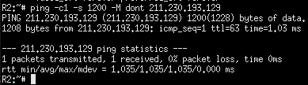
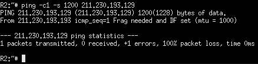
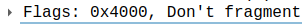
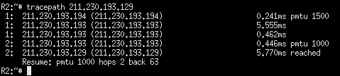
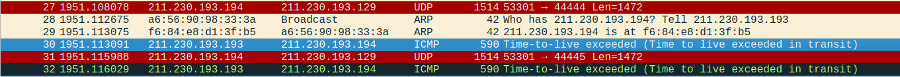
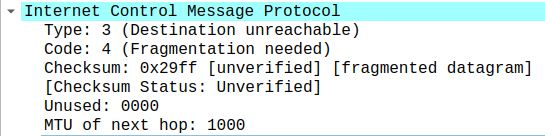

# TP2 - Lucas Plé

## 1. Routage statique

Q1: Les tables de routage des 3 routeurs que l'on vient de lancer sont vides.


Q2: J'ai réutilisé les mêmes adresses que définies en TD, à savoir :
```
R1 : eth0 : 211.230.193.193/30      eth1 : 211.230.193.197/30
R2 : eth0 : 211.230.193.194/30      eth1 : 211.230.193.1/25
R3 : eth0 : 211.230.193.198/30      eth1 : 211.230.193.129/26 
```

Les commandes lancées sur les différents routeurs sont donc celles-ci :


Pour vérifier que les interfaces sont effectivement configurées avec les adresses IP que l'on vient de donner, on utilise la commande `ip address` pour voir les adresses des interfaces de chaque routeur.

.png)

Une fois que les interfaces sont configurées avec les adresses IP correctes, il faut activer ces interfaces. On peut alors lancer ces deux commandes sur chaque routeur :
```
ip link set dev eth0 up
ip link set dev eth1 up
```

Q3: Les routes déjà présentes dans la table sont celles permettant de rediriger vers les réseaux connectés aux routeurs, via leurs interfaces. C'est le système qui les a ajouté automatiquement lors de l'activation des interfaces. La mention `scope link` signifie qu'il s'agit de routes pour des réseaux directement connectés au routeur.


Q4: Pour que tous les routeurs puissent communiquer avec tous les autres réseaux, il faut ajouter les routes suivantes :

```
Pour R1 :
Vers le réseau A -> par eth0 via 211.230.193.194 (eth0 de R2)
Vers le réseau B -> par eth1 via 211.230.193.198 (eth0 de R3)

Pour R2 :
Vers les réseaux b et B -> par eth0 via 211.230.193.193 (eth0 de R1)

Pour R3 : 
Vers les réseaux a et A -> par eth0 via 211.230.193.197 (eth1 de R1)
```

On exécute donc les commandes suivantes :
```
Sur R1 :
ip route add 211.230.193.0/25 dev eth0 via 211.230.193.194
ip route add 211.230.193.128/26 dev eth1 via 211.230.193.198

Sur R2 :
ip route add 0.0.0.0/0 dev eth0 via 211.230.193.193

Sur R3 :
ip route add 0.0.0.0/0 dev eth0 via 211.230.193.197
```

Après ajout des routes, les tables de routage sont dans l'état suivant :


Sur la capture d'écran ci-dessus, j'ai oublié de spécifier le masque réseau pour les routes par défaut sur les routeurs R2 et R3. J'ai rectifié cette erreur juste après en essayant de ping R3 depuis R2.

## 2. Traceroute

Q1: 


Q2: Cette commande renvoie les différents routeurs traversés par le paquet envoyé pour arriver à la destination demandée.

Q3: La première adresse affichée correspond à l'interface eth0 du routeur R1 et la deuxième adresse correspond à l'interface eth1 de R3.

Q4: Le Time To Live du premier paquet envoyé par R2 est à 1. On peut le voir avec wireshark :


Q5: Ce paquet transporte un message au protocole ICMP. Ce message est de Type 8, à savoir une requête ping.

Q6 & Q7: Ce paquet ne parvient pas jusqu'à sa destination car on voit que R1 répond à R2 directement en envoyant un message `Time-to-live exceeded`. Ce message appartient également au protocole ICMP et est de Type 11. Cette réponse signifie que le paquet a été détruit dans R1 car son Time To Live est arrivé à 0 en traversant R1. Ce-dernier prévient donc R2 que son paquet a été détruit, faut de Time To Live restant.

Q8: Le TTL du 2e paquet envoyé par R2 est de 2.


Q9: Ce paquet parvient jusqu'à sa destination puisque le paquet suivant qui passe par eth0 de R1 est la réponse à ce paquet.

Q10: C'est R3 qui répond à ce paquet avec un message du protocole ICMP de Type 0. La réponse signifie que R3 a bien reçu la requête ping envoyée par R2 et lui répond, lui signifiant qu'une route est présente entre les deux routeurs.

Q11: Ce sont les réponses aux deux requêtes ping envoyées par R2. La commande traceroute commence par envoyer un paquet avec un Time To Live à 1 et l'incrémente tant qu'elle ne reçoit pas un paquet ICMP de Type 0. Chaque message signifiant un Time To Live dépassé permet d'obtenir l'adresse IP des routeurs intermédiaires. La réponse ping permet d'obtenir l'adresse IP demandée lors de l'exécution de la commande traceroute. 

Q12: L'adresse renvoyée par traceroute n'est pas l'adresse associée à l'interface eth0 de R3 car lorsque le paquet arrive sur le routeur R3, ce-dernier connaît directement l'adresse demandée puisqu'il s'agit d'une de ses interfaces. Il ne décrémente donc pas le Time To Live du paquet et renvoie directement la réponse ping ICMP. 

## 3. Tracepath

Q1: Les interfaces connectées à la liaison 'b' sont eth1 de R1 et eth0 de R3.
On utilise donc la commande suivante pour changer le MTU sur ces deux interfaces :
```
R1: ip link set dev eth1 mtu 1000
R3: ip link set dev eth0 mtu 1000
```

Q2: On ping depuis R2 vers le réseau B, soit 211.230.193.129 avec un MTU de 1200 :
```
ping -c1 -s 1200 -M dont 211.230.193.129
```
La commande ping affiche qu'un paquet a été transmis et qu'il a été correctement reçu par le destinataire.



Q3: La requête arrive bien à destination. La différence entre la requête envoyée par R2 et la requête après avoir été transmise par R1 est la taille de la requête. On peut voir la taille de la requête dans wireshark : lorsque la requête est envoyée depuis R2, on observe une taille de 1228 octets. Une fois que la requête a traversé R1, on observe une taille de seulement 998 octets et on voit dans la capture de trames un paquet au protocole IPv4 apparaître après notre paquet ICMP avec comme info : 'Fragmented IP protocol'. 

Q4: La même chose se passe pour la réponse envoyée par R3 : elle est fragmentée sur la liaison b pour que la taille du paquet ne dépasse pas 1000 octets (elle fait ici 996 octets) puis elle est reconstituée et envoyée en un seul paquet à R2 lorsqu'elle traverse R1. On ne voit d'ailleurs aucune fragmentation sur la capture de trames de eth0 de R1.

Q5: La commande ping affiche qu'un paquet a été transmis mais qu'il a été totalement perdu.



Q6: La requête ne parvient pas à destination car R1 n'a pas été en mesure de transmettre le paquet sur la liaison b. 



On voit que le flag 'Don't fragment' a été fixé, ce qui veut dire que R1 ne peut pas fragmenter ce paquet qui a une taille de 1228 octets. Ce-dernier est trop gros pour la liaision b et R1 a répondu directement à R2 en lui signifiant que la fragmentation est nécessaire pour transmettre ce paquet.


Q7: R1 dit à R2 que la fragmentation est nécessaire pour ce paquet.

.png)

Q8: Cette commande affiche le mtu maximum que l'on peut utiliser sur la route d'un paquet. Ici, on ne peut pas utiliser des paquets plus grands que 1000 octets.



Q9: Les paquets IP envoyés par R2 transportent des datagrammes UDP ayant pour port de destination un port aléatoire.  


Q10: La valeur du flag 'don't fragment' des paquets IP envoyés par R2 est à 1, ce qui signifie qu'il est fixé et que les paquets IP envoyés ne doivent pas être fragmentés.

Q11: Le TTL est incrémenté successivement dans les paquets IP envoyés par R2.

Q12: C'est l'interface eth0 de R1 qui répond aux deux premiers paquets envoyés. Il répond via le protocole ICMP avec un type 11 : cela signifie que le Time to Live est dépassé.



Q13: Les deux premiers paquets n'arrivent pas à destination car leur Time to Live n'est pas assez élevé pour passer le routeur R1.

Q14: C'est l'interface eth0 de R1 qui répond au troisième paquet envoyé. Il répond via le protocole ICMP avec un type 3 et un code 4 : La destination n'est pas atteignable car une fragmentation est nécessaire.


Q15: Le troisième paquet n'arrive pas à destination car il est bloqué au niveau de R1 : le paquet est trop grand et ne peut pas être transmis sur la liaison b sans fragmentation.

Q16: C'est l'interface eth1 de R3 qui nous répond. Elle nous répond avec le protocole ICMP, un type 3 et un code 3 : la destination n'est pas atteignable car le port spécifié est inatteignable. 


Q17: Le quatrième paquet arrive à destination car c'est le destinataire spécifié qui nous répond. Cela montre que l'on est bien arrivé à la machine que l'on souhaite avec un time to live et une fragmentation corrects.

Q18: Tracepath a su que la liaison b avait un MTU de 1000 car lorsque R1 a répondu qu'une fragmentation était nécessaire, il lui a spécifié le MTU du prochain lien sur le réseau au sein du paquet ICMP. Tracepath a récupéré cette information et a pu adapter sa taille de paquets. 



Q19: La commande tracepath envoie des paquets avec le protocole UDP vers la destination spécifié. Elle commence par envoyer des paquets avec un Time To Live de 1 et l'incrémente au fur et à mesure si le paquet doit traverser un routeur. La taille du paquet est en premier lieu fixé au MTU du lien local puis, si un routeur lui informe, elle baisse la taille du paquet pour que le paquet arrive jusqu'à la destination et qu'elle obtienne une réponse ICMP 'port unreachable'. Elle pourra alors nous donner le nombre de routeur à traverser ainsi que la taille maximale de paquet que l'on peut utiliser sur la route jusqu'à la destination.

Q20: Traceroute et tracepath augmentent au fur et à mesure le time to live des paquets à mesure que les paquets envoyés doivent traverser des routeurs. On connaît également l'adresse IP des routeurs traversés ainsi que du Time to Live nécessaire pour les atteindre.

Q21: Lors de l'utilisation de traceroute, ce-dernier n'utilisait pas des paquets udp comme l'a fait tracepath, même s'il est normalement possible d'utiliser traceroute en udp. Traceroute ne donnait pas le MTU maximal de la route.

## 4. RIP

Q1: Sur R1, j'exécute les commandes suivantes :
```
zebra -d
ripd -d
vtysh
configure terminal 
router rip
network 211.230.193.192/30
```

On voit sur la capture de trames qu'un message est passé sur l'interface eth0 de R1.

Q2: Le protocole RIP appartient à la couche réseau de modèle OSI. Il utilise le protocole UDP. Les ports source et destination utilisés par RIP est uniquement le port 520. L'adresse de destination des messages est 224.0.0.9.